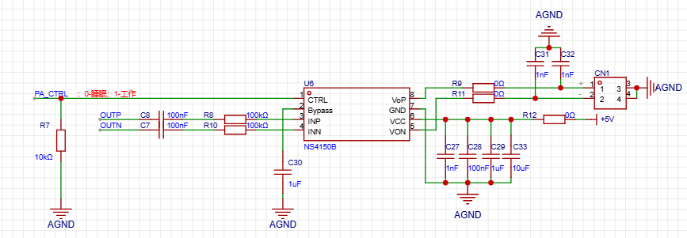
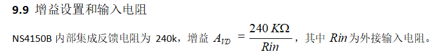

## 引脚分析

**1 PA_CTRL**：通过单片机的IO口控制，0-睡眠 1-工作；下拉电阻确保 MCU 未初始化时芯片处于 Shutdown 模式。
**2 Bypass** : 内部共模电压旁路电容脚，固定接 1uF 电容至 GND。
**3/4 INP/INN**:音频输入正/负极；P和N的Rin需要同时设置100K，增益为2.4倍
输入电容 Cin 与输入电阻 Rin构成一个高通滤波器截止频率为fc = 1 / (2π · Rin · Cin)，得到的结果是15.9Hz
**5/8 VON/VOP** :