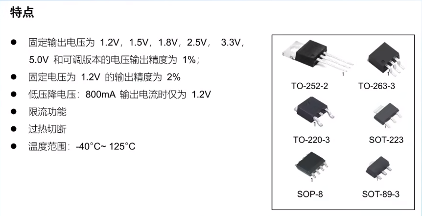
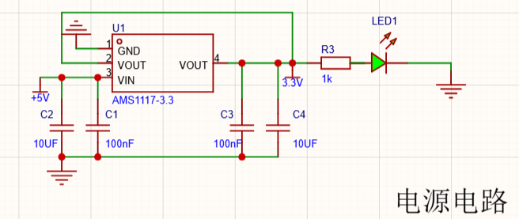
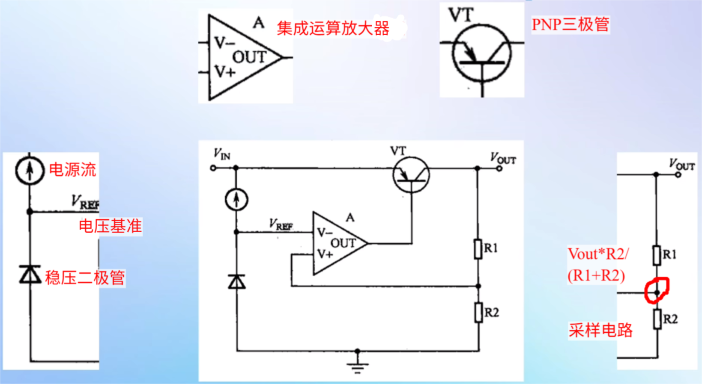
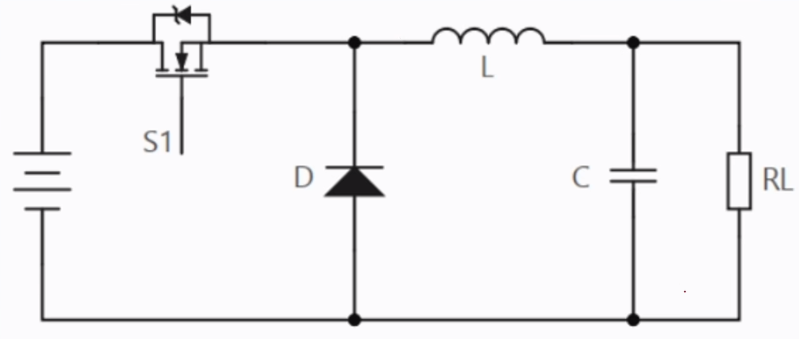
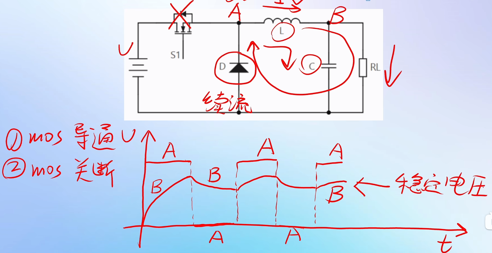
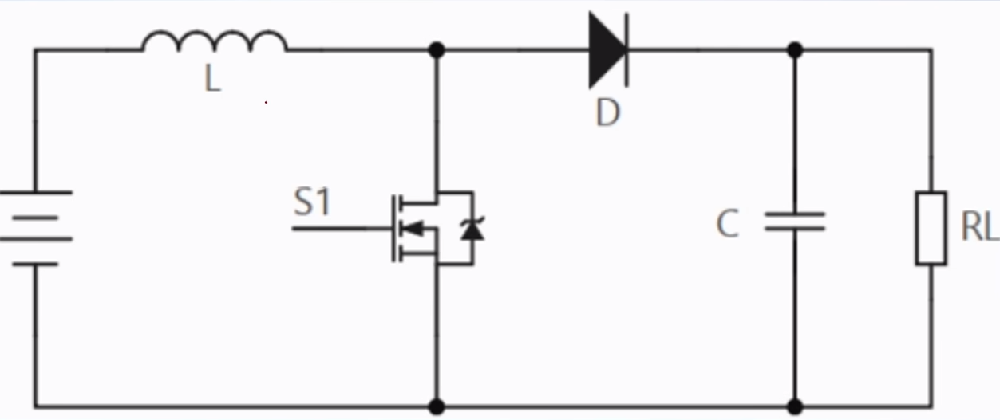
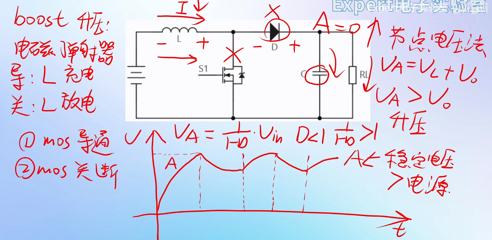

### LDO

##### AMS1117电源芯片：

##### LDO内部电路：

**优点：LDO电路外围器件少，电路简单，成本低，通常只需要一两个旁路电容**
**	   LDO负载响应快，输出波纹小，噪声小**
**缺点：LDO效率低，输入输出压差不能太大；只能降压不能升压；输出电流有限，最高只能几A**

### DCDC电路

#### BUCK电路 ：以降压为目的

#### BOOST电路：以升压为目的

**DCDC优点：效率高，输出电压范围宽泛；支持降压和升压；输出电流高，功率大**
**DCDC缺点：外围器件多，电路复杂，成本高；负载响应比LDO慢，输出纹波大，噪声大**
